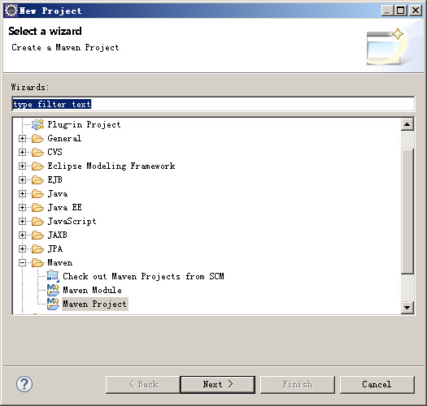
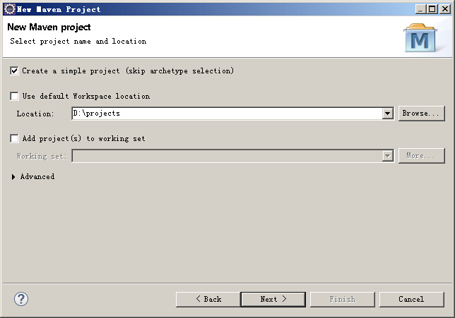
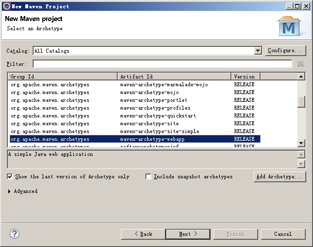
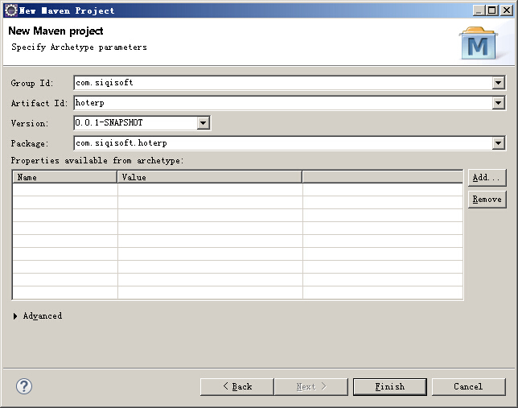
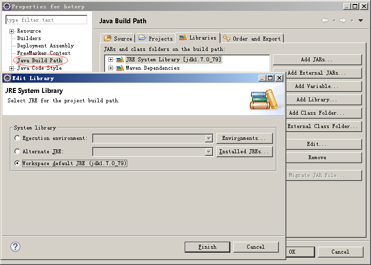
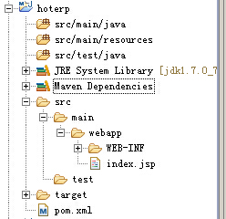

# 创建基于stone的工程

为了快速地了解stone提供的功能，我们从创建一个基于stone的工程开始。

基本的步骤是：
1. 准备好pgsql数据库。
2. 通过Eclipse创建一个普通的maven结构的web项目。
3. 在项目的pom.xml文件中增加stone依赖。
4. 在Eclipse中运行该项目，通过浏览器查看stone提供的功能。

##准备pgsql数据库

可以从官方网站(http://www.postgresql.org) 上下载pgsql的安装包，按默认安装后，会内置一个简单的数据库管理工具pgAdmin3。我们将通过pgAdmin3登陆数据库服务器，并创建一个新的数据库.

1.点击paAdmin3上方的插头按钮，在弹出的界面中填写好名称、主机字段。
点击确定按钮

2.双击打开服务器组，逐次展开到数据库节点，在数据库上右键，新建数据，在弹出的界面上填写好数据库名称（本例中的名称叫做hoterp），点击确定按钮。

初次使用pgsql数据库，可以先不关注数据库的用户、权限等信息，使用postgres账户进行试用和开发即可，但是在生产环境中，还请注意创建不同的角色和权限，以适应应用的安全需要。

##在Eclipse中创建一个普通的maven webapp工程

打开Eclipse，选择菜单上的fiel->new->Project,在弹出的窗口中找到Maven Project：

下一步，选择好项目的路径，我一般将项目都放在D盘的projects目录下：

第三步，选择maven-archetype-webapp这个结构：

第四步，填写好GroupId和ArtifactId:

在笔者的电脑上按如上步骤建立好工程以后，在Eclipse中没有出现经典的`src\main\java`,目测JRE System Library是1.5的，在项目上右键->Properities，在Java Build Path的Libraries中选中JRE System Library，点击右下角的Edit,切换为Workspace default JRE即可。

最终的项目结构如下图所示：

