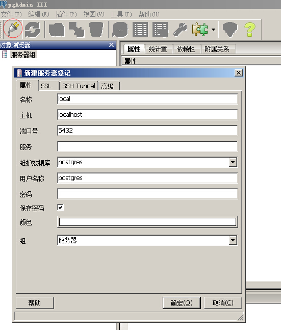
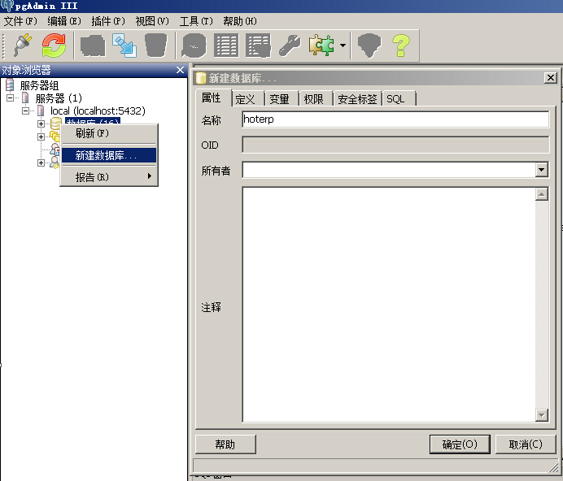

# 创建基于stone的工程

为了快速地了解stone提供的功能，我们从创建一个基于stone的工程开始。

基本的步骤是：
1. 准备好pgsql数据库。
2. 通过Eclipse创建一个普通的maven结构的web项目。
3. 在项目的pom.xml文件中增加stone和stone-sdk的依赖。
4. 在eclipse中运行该项目，通过浏览器查看stone-sdk提供的功能。

##准备pgsql数据库

可以从官方网站(http://www.postgresql.org) 上下载pgsql的安装包，按默认安装后，会内置一个简单的数据库管理工具pgAdmin3。我们将通过pgAdmin3登陆数据库服务器，并创建一个新的数据库.

1.点击paAdmin3上方的插头按钮，在弹出的界面中填写好名称、主机字段。
点击确定按钮

2.双击打开服务器组，逐次展开到数据库节点，在数据库上右键，新建数据，在弹出的界面上填写好数据库名称（本例中的名称叫做hoterp），点击确定按钮。

初次使用pgsql数据库，可以先不关注数据库的用户、权限等信息，使用postgres账户进行试用和开发即可，但是在生产环境中，还请注意创建不同的角色和权限，以适应应用的安全需要。

##创建一个普通的maven工程

我们使用Eclipse作为开发环境，在Eclipse中创建一个web应用的基本步骤如下：