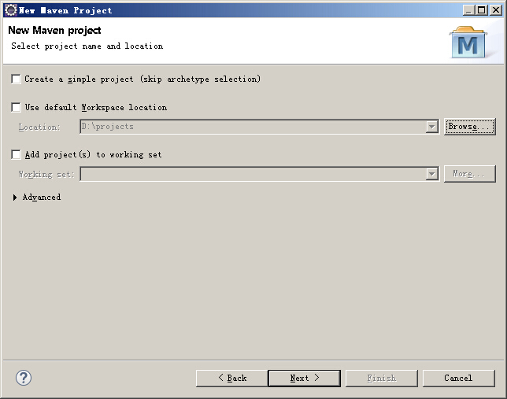

# 创建基于stone的工程

##准备pgsql数据库

##在Eclipse中创建一个普通的maven webapp工程

打开Eclipse，选择菜单上的fiel->new->Project,在弹出的窗口中找到Maven Project：

下一步，选择好项目的路径，我一般将项目都放在D盘的projects目录下：

第三步，选择maven-archetype-webapp这个结构：

第四步，填写好GroupId和ArtifactId:

在笔者的电脑上按如上步骤建立好工程以后，在Eclipse中没有出现经典的`src\main\java`源代码目录,目测JRE System Library是1.5的。于是在项目上右键->Properities，在Java Build Path的Libraries中选中JRE System Library，点击右下角的Edit,切换为Workspace default JRE即可。

最终的项目结构如下图所示：

