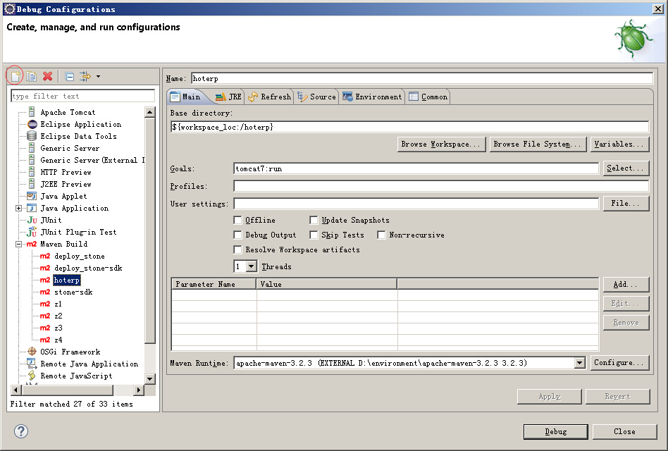

# 增加tomcat-maven插件

我们在Eclipse中编写的代码，需要在web容器中运行，以验证代码写得对不对。如果有错误，还需要Eclipse和web容器结合工作，在Eclipse中增加断点，进行调试。

tomcat提供了一个maven插件，帮助我们结合maven在开发中进行调试。我们在pomx中引入tomcat的maven插件，然后在Eclipse中进行调用maven的插件，启动tomcat，完成开发中的验证与调试工作。

在pom.xml中的plugins节点下增加插件，代码如下：
```
<!-- Tomcat7 -->
<plugin>
	<groupId>org.apache.tomcat.maven</groupId>
	<artifactId>tomcat7-maven-plugin</artifactId>
	<version>2.0</version>
	<configuration>
		<port>3234</port>
		<path>/hoterp</path>
		<uriEncoding>UTF-8</uriEncoding>
	</configuration>
</plugin>
```

在Eclipse中，启动tomcat的maven插件：
在Eclipse菜单中选择run->Debug Configurations,在弹出的窗口中，选择Maven Build 节点，点击左上方的加号按钮，在右侧填写好名字、通过Browse Workspace按钮选择hoterp工程，在Goals中填写`tomcat7:run`，点击apply保存设置，点击Debug按钮，即可开启tomcat。



我们在浏览器中输入地址`http://localhost:3234/hoterp/`，会看到Hello World!

点击Eclipse的Console窗口右上放的红色方块（Terminate）按钮，即可关闭tomcat。以后再需要调试，从Eclipse上方工具栏的debug按钮（绿色的小虫子）下拉，即可看到hoterp调试按钮。


