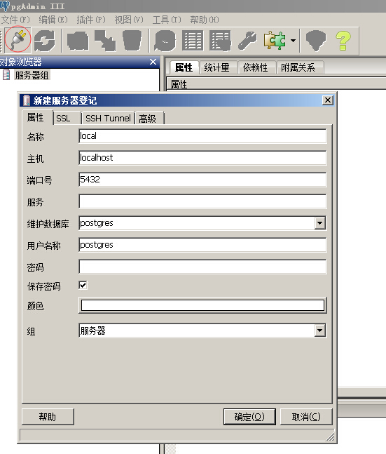

# 准备数据库

可以从官方网站(http://www.postgresql.org) 上下载pgsql的安装包，按默认安装后，会内置一个简单的数据库管理工具pgAdmin3。我们将通过pgAdmin3登陆数据库服务器，并创建一个新的数据库.

1.点击paAdmin3上方的插头按钮，在弹出的界面中填写好名称、主机字段。
点击确定按钮

2.双击打开服务器组，逐次展开到数据库节点，在数据库上右键，新建数据，在弹出的界面上填写好数据库名称（本例中的名称叫做hoterp），点击确定按钮。

初次使用pgsql数据库，可以先不关注数据库的用户、权限等信息，使用postgres账户进行试用和开发即可，但是在生产环境中，还请注意创建不同的角色和权限，以适应应用的安全需要。